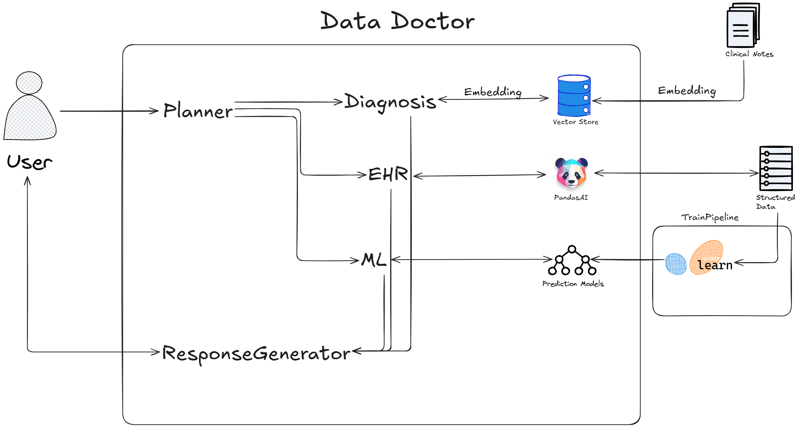

# Data Doctor

Data Doctor is the core of an AI assistant designed to explore patient data, answer health-related questions, and provide predictions.

It uses:
- **Langgraph** to coordinate multiple AI agents,
- **XGBoost** as the clinical predictor,
- **PandasAI** to retrieve information from patient data CSV files.

System architecture can be seen in the following diagram:



## Prerequisites

- Python 3.10–3.11
- [Poetry](https://python-poetry.org/docs/#installation)
- [Docker](https://docs.docker.com/get-docker/)
- The following Python libraries (installed automatically with Poetry):
  - `langgraph`
  - `xgboost`
  - `pandas`
  - `qdrant-client[fastembed]`

## System Overview

Data Doctor is composed of several specialized agents:

- **MainAgent**: Coordinates the execution of all agents.
- **Planner**: Routes user requests to the appropriate agent(s).
- **ML**: Extracts information from requests and generates predictions for chronic obstructive pulmonary disease and alanine aminotransferases.
- **EHR**: Uses PandasAI to retrieve information from patient data files.
- **Diagnosis**: Extracts information from clinical diagnosis markdown files using vector similarity search on the Qdrant vector database.
- **ResponseGenerator**: Summarizes findings and generates user-friendly responses.

## Installation

```bash
git clone https://github.com/AugustC/data-doctor.git
cd data-doctor
poetry install
```

## Setup

1. Place your patient data files in the `data/` directory.
2. Place clinical diagnosis `.md` files in `data/md_documents/`.
3. Copy `.env.example` to `.env` and fill in the required environment variables.

## Starting Qdrant Service

Download the latest Qdrant image:

```bash
docker pull qdrant/qdrant
```

Run the Qdrant service:

```bash
docker run -p 6333:6333 -p 6334:6334 \
    -v "$(pwd)/qdrant_storage:/qdrant/storage:z" \
    qdrant/qdrant
```

## Usage

Start the assistant:

```bash
poetry run python -m main
```

Interact by asking questions when prompted.

## License

[MIT](LICENSE)
